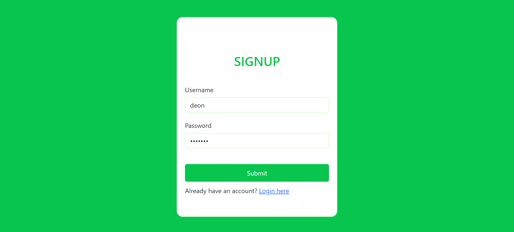
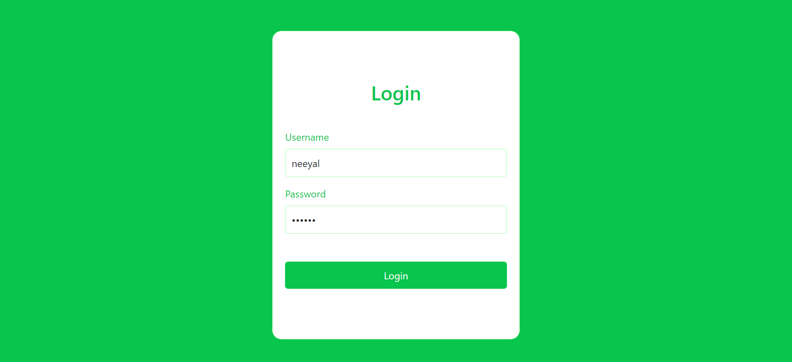

# Guvi Signup/Login Page Project

## Introduction

Welcome to the Guvi Signup/Login Page Project! This web application is designed to provide a simple and secure user authentication system. The technology stack includes HTML, CSS, JavaScript, PHP, MySQL, and MongoDB. The primary focus is on creating an intuitive and user-friendly interface to enhance the user experience.

### Screenshots

Check out these screenshots to get a glimpse of the project:




## Features

1. **User Registration:**
   - Allow users to sign up with their details.
   - Ensure the registration process is straightforward and user-friendly.

2. **Login Authentication:**
   - Implement secure login authentication to verify user credentials.
   - Use encryption techniques for password storage to enhance security.

3. **Secure Password Handling:**
   - Prioritize the use of encryption techniques to ensure the security of stored passwords.
   - Implement industry-standard practices for handling sensitive user data.

4. **Responsive Design:**
   - Ensure a seamless user experience across various devices and screen sizes.
   - Implement responsive design principles for a visually appealing interface.

## Getting Started



### Prerequisites

Before running the project locally, ensure you have the following:

- [XAMPP](https://www.apachefriends.org/index.html) or any other PHP development environment.
- A modern web browser.


### Installation

1. Clone the repository to your local machine:

   ```bash
   git clone https://github.com/NeeyalD/guvi
   ```

2. Start your PHP development server or use XAMPP.

3. Open the project in your web browser.

## Note

Due to the use of an online free SQL database, data storage might take some time. The provided code is compatible with an online database.

## Usage

1. Open the project in your web browser.

2. Navigate to the Signup page and create a new account.

3. Use the Login page to sign in with your credentials.

4. Explore the simple and intuitive user interface.

## Live Demo

For a live demo of this project, [click here](https://neeyald.github.io/guvi/).

## Contributing

Feel free to contribute to the project by submitting bug reports, feature requests, or pull requests. Your input is valuable in enhancing the project.

## Acknowledgments

Special thanks to Guvi for providing this project task. Your guidance and support are appreciated.

Enjoy exploring and using the Guvi Signup/Login Page Project!
